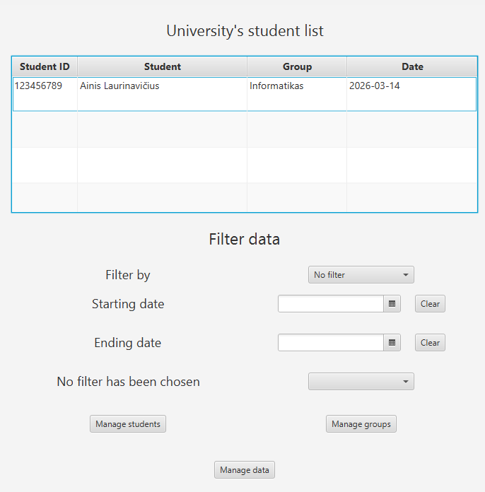

# Student attendance application

## Table of Contents
- [About](#about)
- [Installation & setup](#installation--setup)
- [Usage](#usage)
- [License](#license)

## About
This is a simple JavaFx program to manage student attendance and assigned groups.

## Installation & setup
```bash
# clone the repo
git clone https://github.com/AinisALaur/Student-attendance-application.git
```

## Usage


Simply populate the program with information as needed, which can later be filtered, modified, deleted.

## License
This project currently has no license assigned. All rights reserved until a license is chosen.
